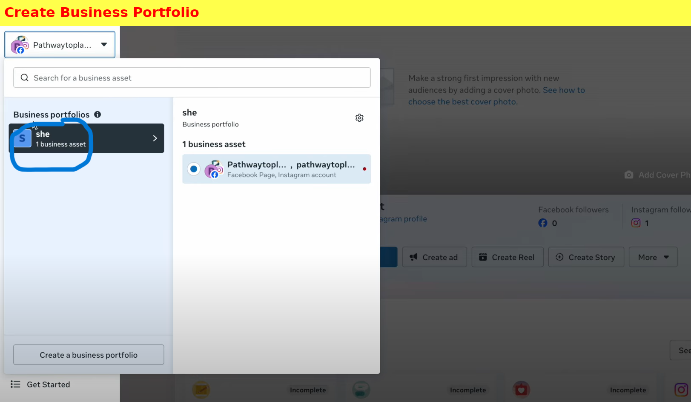
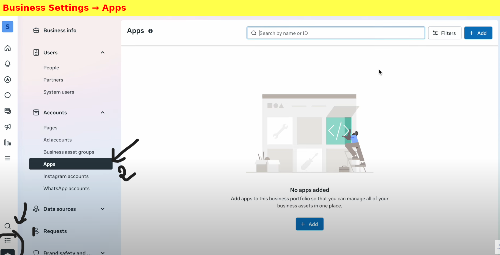
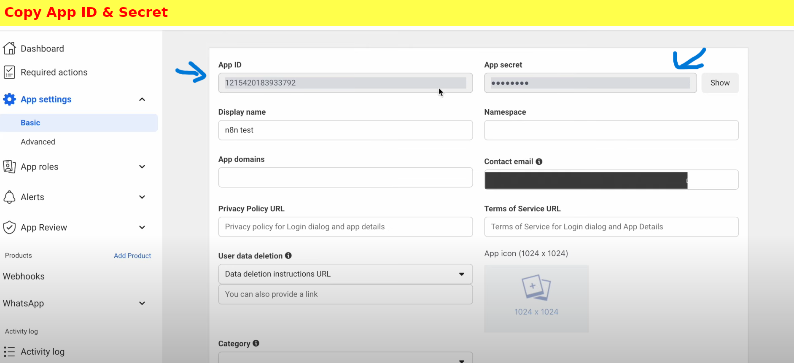
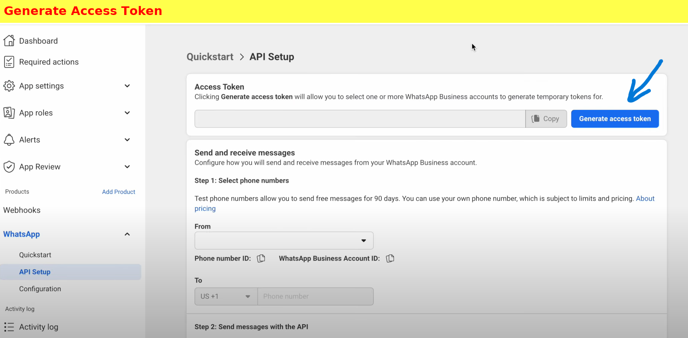
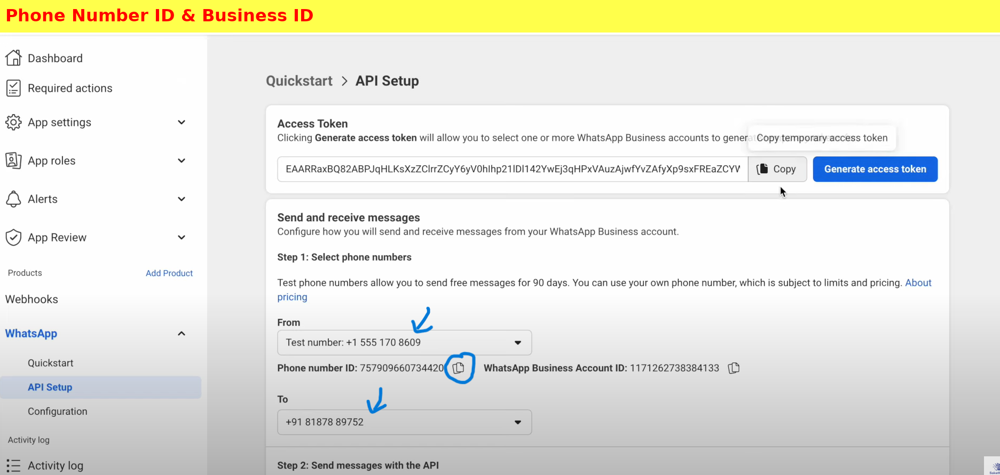

#  Complete WhatsApp AI Bot Setup Guide
*The Ultimate Beginner-Friendly Tutorial*

---

##  What You'll Build

By the end of this guide, you'll have a fully functional WhatsApp AI bot that:
-  Responds to messages automatically
-  Uses Google Gemini AI for intelligent replies
-  Works 24/7 without manual intervention
-  Handles multiple conversations simultaneously
-  Requires zero coding experience

---

##  Prerequisites

Before we start, make sure you have:
- [ ] A Facebook/Meta account
- [ ] A WhatsApp Business account
- [ ] Access to n8n (cloud or self-hosted)
- [ ] A Google account for Gemini API
- [ ] 30-45 minutes of setup time

---

##  Step 1: Create Your n8n Workflow

**Purpose:** Think of a workflow as your bot's blueprint - it's where all the automation magic happens.

### Instructions:
1. **Open n8n** in your browser
2. Click the **"+ New Workflow"** button (usually in the top-right corner)
3. **Rename your workflow** by clicking on "Untitled Workflow" at the top
   - Suggested name: `WhatsApp AI Bot v1.0`
   - This helps you identify it later if you create multiple bots

###  Pro Tip:
Create a dedicated folder for your WhatsApp bots to stay organized as you expand your automation projects.

---

##  Step 2: Add WhatsApp Trigger Node

**Purpose:** This is your bot's "ears" - it detects when someone sends you a WhatsApp message.

### Instructions:
1. **Click the "+" button** to add a new node
2. **Search for "WhatsApp"** in the node library
3. **Select "WhatsApp Trigger"** or "On Message Connector"
4. **Drag it to your canvas**

###  Node Configuration:
- **Trigger Type:** Message Received
- **Message Types:** Text (you can expand this later)
- **Webhook URL:** Will be auto-generated

---

##  Step 3: Setup Meta Business Integration

**Purpose:** WhatsApp Business API requires a Meta Business Portfolio for enterprise-level access and security.

### Step 3.1: Create Business Portfolio

 


1. **Navigate to** [Meta Business Suite](https://business.facebook.com/)
2. **Sign in** with your Facebook credentials
3. **Click "Create Business Portfolio"**
4. **Fill in your business details:**
   - Business Name: Your company or personal brand name
   - Primary Page: Link your Facebook page (create one if needed)
   - Business Address: Your business location
   - Contact Information: Valid email and phone number

 


### Step 3.2: Create Meta App

1. **Go to Settings** → **Apps** in Business Suite
2. **Click "+ Add"** → **"Create a New App ID"**
3. **Configure your app:**
   - **App Name:** `n8n WhatsApp AI Bot`
   - **App Type:** Business App
   - **Category:** Communication
   - **Purpose:** Customer Support/Engagement

  

 

### Step 3.3: Retrieve API Credentials

1. **Navigate to** App → Settings → Basic
2. **Copy and securely store:**
   - **App ID** (16-digit number)
   - **App Secret Key** (32-character string)
   - **Business Portfolio ID**


###  Security Note:
Store these credentials in a secure password manager. Never share them publicly or commit them to version control.

 

---

##  Step 4: Configure AI Agent

**Purpose:** This defines your bot's personality, tone, and response style.

### Instructions:
1. **Add "AI Agent" node** from the AI category
2. **Configure the system prompt:**

```
You are Lex Bot, an intelligent WhatsApp assistant designed to provide helpful, friendly support.

PERSONALITY TRAITS:
- Friendly and approachable
- Concise but informative
- Professional yet conversational
- Helpful and solution-oriented

RESPONSE GUIDELINES:
- Keep responses between 2-4 lines
- Use simple, clear language
- Be conversational, not robotic
- Ask follow-up questions when appropriate
- Use emojis sparingly but effectively

CONTEXT:
User's message: "{{ $json.messages[0].text.body }}"
User's name: "{{ $json.messages[0].from }}"
Timestamp: "{{ $json.messages[0].timestamp }}"

Remember to stay helpful and maintain a positive tone in all interactions.
```

###  Customization Options:
- **Formal Business:** Remove emojis, use formal language
- **Casual Friend:** Add more personality, use slang appropriately
- **Technical Support:** Include troubleshooting steps, ask diagnostic questions
- **Sales Assistant:** Focus on product benefits, include call-to-actions

---

##  Step 5: Integrate Google Gemini AI

**Purpose:** This is your bot's "brain" - the AI engine that generates intelligent responses.

### Getting Gemini API Key:
1. **Visit** [Google AI Studio](https://makersuite.google.com/app/apikey)
2. **Sign in** with your Google account
3. **Click "Create API Key"**
4. **Copy the generated key** (starts with "AIza...")

### n8n Configuration:
1. **Add "Google Gemini Chat Model" node**
2. **Configure settings:**
   - **API Key:** Paste your Gemini key
   - **Model:** `gemini-2.0-flash`
3. **Connect** AI Agent → Gemini node

---

##  Step 6: Setup WhatsApp Response System

**Purpose:** This sends the AI-generated responses back to your WhatsApp contacts.

### Meta Developer Console Setup:
1. **Go to** [Meta for Developers](https://developers.facebook.com/)
2. **Navigate to** your app → WhatsApp → API Setup
 

3. **Generate required credentials:**

 

#### Required Information:
- **Access Token:** 
  - Valid for 24 hours (temporary)
  - Used for API authentication
  - Format: `EAAxxxxxxxxxx...`

- **Phone Number ID:**
  - Your WhatsApp Business number identifier
  - Format: `15xxxxxxxxxx`

- **Business Account ID:**
  - Your Meta Business Account identifier
  - Format: `10xxxxxxxxxx`

### n8n Send Message Configuration:
1. **Add "Send Message & Wait for Response" node**
2. **Configure credentials:**
   - **Access Token:** Paste from Meta console
   - **Phone Number ID:** From WhatsApp API setup
   - **Business Account ID:** From your business settings
3. **Message Configuration:**
   - **To:** `{{ $json.from }}` (responds to sender)
   - **Message:** `{{ $json.output }}` (AI response)
   - **Message Type:** Text

---

##  Step 7: Connect Your Workflow

**Purpose:** Link all components to create a seamless automation flow.

### Connection Sequence:
```
WhatsApp Trigger → AI Agent → Google Gemini → Send Message
```

### Node Connections:
1. **WhatsApp Trigger** output → **AI Agent** input
2. **AI Agent** output → **Google Gemini** input  
3. **Google Gemini** output → **Send Message** input

### Data Flow Configuration:
- **Trigger passes:** Message content, sender info, timestamp
- **AI Agent processes:** Context and generates prompt
- **Gemini returns:** AI-generated response
- **Send Message delivers:** Response back to WhatsApp

---

##  Step 8: Testing & Deployment

### Pre-Launch Checklist:
- [ ] All nodes are connected properly
- [ ] API credentials are valid and working
- [ ] System prompt is configured
- [ ] WhatsApp webhook is active
- [ ] Test message flow works end-to-end

### Testing Process:
1. **Save your workflow** (Ctrl+S or Cmd+S)
2. **Activate the workflow** (toggle switch in top-right)
3. **Send a test message** to your WhatsApp Business number
4. **Verify the bot responds** within 5-10 seconds
5. **Test different message types** (questions, statements, requests)

### Troubleshooting Common Issues:

| Problem | Solution |
|---------|----------|
| Bot doesn't respond | Check webhook URL, verify access token |
| Responses are slow | Reduce max tokens, check API quotas |
| Generic responses | Improve system prompt, add more context |
| Connection errors | Verify all API credentials are current |

---

##  Step 9: Advanced Enhancements

### Feature Additions:
- **Image Processing:** Add vision capabilities with Gemini Pro Vision
- **Voice Messages:** Integrate speech-to-text conversion
- **Multi-language:** Add translation nodes for global support
- **Database Integration:** Store conversation history
- **Analytics:** Track usage patterns and popular queries
- **Scheduled Messages:** Send proactive updates

### Scaling Considerations:
- **Rate Limits:** Monitor API usage across all services
- **Cost Management:** Set up billing alerts for API usage
- **Performance:** Consider caching for frequently asked questions
- **Compliance:** Ensure GDPR/privacy compliance for user data

---

##  Monitoring & Maintenance

### Daily Tasks:
- [ ] Check execution logs for errors
- [ ] Monitor API usage and costs
- [ ] Review conversation quality

### Weekly Tasks:
- [ ] Update access tokens (if using temporary ones)
- [ ] Analyze conversation patterns
- [ ] Refine system prompts based on user feedback

### Monthly Tasks:
- [ ] Review and update AI model settings
- [ ] Backup workflow configurations
- [ ] Assess and optimize performance metrics

---

##  Security Best Practices

### API Security:
- **Rotate tokens regularly** (at least monthly)
- **Use environment variables** for sensitive data
- **Implement rate limiting** to prevent abuse
- **Monitor unusual activity** in API logs

### Data Privacy:
- **Minimize data collection** to essential information only
- **Implement data retention policies** 
- **Secure data transmission** with HTTPS/WSS
- **Comply with regional privacy laws** (GDPR, CCPA, etc.)

---

##  Success Metrics

Track these KPIs to measure your bot's effectiveness:

- **Response Rate:** % of messages that receive responses
- **Response Time:** Average time between message and reply
- **User Satisfaction:** Based on follow-up questions/complaints
- **Conversation Resolution:** % of queries resolved without escalation
- **Engagement Rate:** Repeat interactions from users

---

##  Congratulations!

You've successfully built a sophisticated WhatsApp AI bot that can:
-  Handle customer inquiries automatically
-  Provide intelligent, contextual responses
-  Scale to handle multiple conversations
-  Operate 24/7 without manual intervention

### Next Steps:
1. **Monitor performance** for the first week
2. **Gather user feedback** and refine responses
3. **Explore advanced features** like image processing
4. **Consider building additional bots** for different use cases

---

*Happy automating! *

---

**Made by BOTCAMPUS.AI** 
