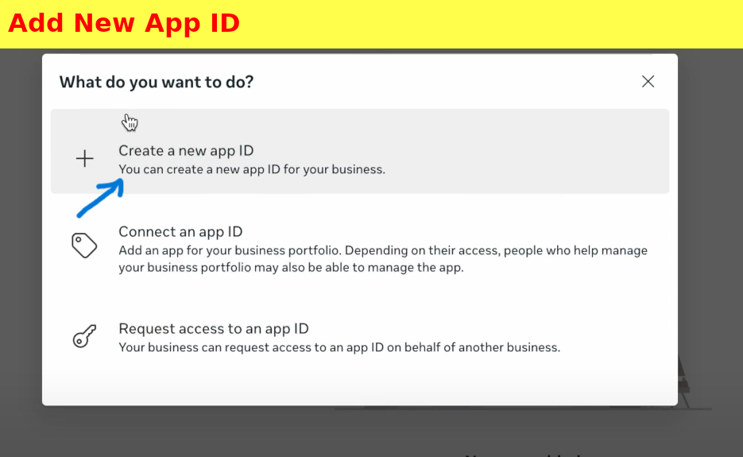
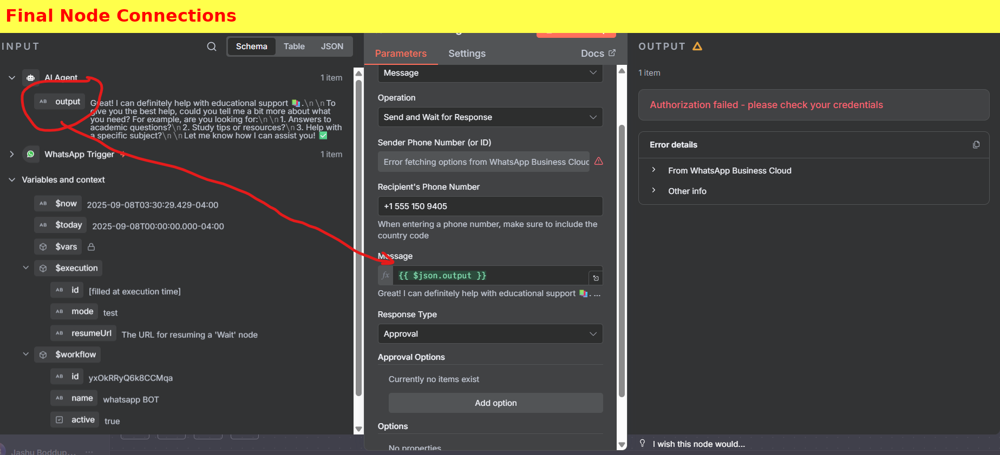

# 🚀 WhatsApp Bot Setup Guide (Beginner Friendly)

This guide will help you set up a WhatsApp Bot in **n8n** step by step.  
Don’t worry if you’re not technical — just follow each step carefully, and you’ll have your bot running in no time!  

---

## ✅ Step 1: Create a New Workflow in n8n
1. Open **n8n**.  
2. Click **+ (Create Workflow)**.  
3. Give it a name (e.g., `WhatsApp BOT`).  

👉 Think of this workflow as your “automation project” where each block performs a specific action.  

---

## ✅ Step 2: Add WhatsApp Trigger Node
1. In the workflow editor, search for **WhatsApp**.  
2. Select **On Message Connector** (this listens whenever you receive a new WhatsApp message).  

👉 This is like saying: *“Whenever someone messages my WhatsApp Business account, start this automation.”*  

---

## ✅ Step 3: Connect Your WhatsApp Business Account

To make n8n talk to WhatsApp, we need credentials (**App ID, Secret, and Access Token**) from Meta (Facebook).  

### 3.1 Create a Business Portfolio
- Go to [Meta Business Suite](https://business.facebook.com/)  
- Log in with your Facebook account.  
- Create a **Business Portfolio** and fill in your details.  

  

---

### 3.2 Add a New App
- In your portfolio, go to **Settings → Apps**.  
- Click **+ Add → Create a New App ID**.  

➡️ Enter details:  
- App Name: e.g., `n8n Test`  
- Choose **Business App**  
- Enter your email and link it to your portfolio  

  
  

---

### 3.3 Copy App ID & Secret
👉 Once done, you’ll see your **App ID** and **App Secret**.  
⚠️ Copy these — you’ll need them inside n8n WhatsApp credentials.  

  

---

## ✅ Step 4: Configure AI Agent in n8n
1. Search for **AI Agent** in n8n and add it after the WhatsApp Trigger.  
2. Set the **System Prompt**. Example:  

```
# WhatsApp Q/A Bot - System Prompt
You are Lex Bot, a friendly WhatsApp assistant.  
Answer the user’s latest message clearly and simply.  

## Current User Message
👉 "{{ $json.messages[0].text.body }}"

## Rules
- Keep replies short (2–4 lines max)  
- Be conversational and direct  
- Use plain text only  
- End with a follow-up or question  

## Task
Reply with one WhatsApp-ready answer.
```

👉 This tells the AI how to behave (short, clear, and friendly answers).  

---

## ✅ Step 5: Add Google Gemini Chat Model
1. Search for **Google Gemini Chat Model** node.  
2. Connect it to the **AI Agent**.  
3. Paste your **Gemini API Key**.  

👉 Now the AI agent can “think” and respond intelligently.  

---

## ✅ Step 6: Connect WhatsApp Sending Node
This is the most important part — **sending messages back**.  

1. Add a **Send Message and Wait for Response** node.  
2. Configure it with credentials:  
   - **Access Token** (from Meta, valid for 24 hours).  
   - **Business Account ID**.  
   - **Phone Number ID**.  

### How to Get These (Meta Developer Console):  
- Go to **App → WhatsApp → API Setup**.  

  

- Click **Generate Access Token** (works for 24 hrs).  

  

👉 Paste these values into your n8n WhatsApp node.  

⚠️ Note: To test, use Meta’s **Test Number** (provided in console). You can also link your own number after verifying.  

---

## ✅ Step 7: Connect the Flow
- Connect **AI Agent output → Send Message Node**.  
- In “Message” field, insert `{{ $json.output }}` (this passes the AI’s reply).  
- Enter your recipient phone number (e.g., your WhatsApp number).  

  

---

# 🎉 Done!
Now test your workflow:  
1. Send a WhatsApp message to your test number.  
2. The AI agent will process it and reply automatically!  

---

## ⚠️ Common Issues & Fixes
- **Authorization Failed** → Your Access Token expired. Generate a new one.  
- **No Reply** → Check if your recipient number is added & verified.  
- **Workflow not running** → Ensure the workflow is **Active** (toggle ON).  

---
